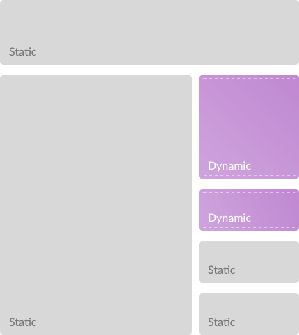

# 🏎 next-super-performance

Partial hydration for [Next.js](https://github.com/zeit/next.js/) with [Preact X](https://github.com/developit/preact).

---

**Explanation:** At spring we are creating websites for newspapers and we are very, **very** performance aware.

Newspapers are mostly static pages. Now if we were to create a single page application we would
create a huge bundle with mostly unnecessary code.

This does not only mean that users wait for a big file to download, but [as Addy Osmami points out](https://medium.com/@addyosmani/the-cost-of-javascript-in-2018-7d8950fbb5d4)
there is a huge cost in performance with parsing and executing code. As a vague rule of thumb we can
say, the bigger your bundle, the worse your performance.

---

 

That is why we aim to cut bundle size by only shipping the code we actually need in the client and leave the rest to server side rendering.
