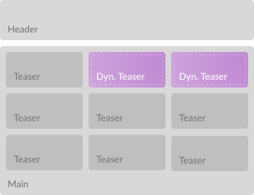

# 🏎 next-super-performance


Partial hydration for [Next.js](https://github.com/zeit/next.js/) with [Preact X](https://github.com/developit/preact).

---

**Explanation:** At spring we are creating websites for newspapers and we are very, **very** performance aware.

Newspapers are mostly static pages. Now if we were to create a single page application we would
create a huge bundle with mostly unnecessary code.

This does not only mean that users wait for a big file to download, but [as Addy Osmami points out](https://medium.com/@addyosmani/the-cost-of-javascript-in-2018-7d8950fbb5d4)
there is a huge cost in performance with parsing and executing code. As a vague rule of thumb we can
say, the bigger your bundle, the worse your performance.

---

<br/>

That is why we aim to cut bundle size by only shipping the code we actually need in the client and leave the rest to server side rendering.

## Overview

This repo ist still a proof of concept, we will continue to work on this and implement our work
as 2 packages:

- `pool-attendant-preact` A library that implements partialy hydration with preact x
- `next-super-performance` A Next.js plugin that uses pool-attendant-preact to improve client side performance

On top of partial hydration we will implement loading strategies including `critical CSS`, `critical JS`, `lazy loading`, `preloading ressources`, etc. as part of next-super-performance.

## Documentation

For now we have a partial hydration POC for Next.js and this is how it works. When you create a `next.config.js` and use our plugin like so

```js
const withSuperPerformance = require("next-super-performance");
module.exports = withSuperPerformance();
```

2 things will happen:

- `React` will be replaced by `Preact` because it is only 3KB
- Next.js' main client JavaScript file will be discarded and replaced by a JavaScript file in your control

That means you have to create a `client.js` in your app's root folder that will act as the entry
point for the JavaScript that will be sent to the client. We do this to give you full control of
what you want your users to download and, very importantly, to choose the loading strategy that is
right for you.

Now `pool-attendant-preact` comes into play. pool-attendant-preact exports 3 APIs for you:

- `withHydration` a HOC that lets you mark your components for hydration
- `hydrate` a function to hydrate marked components in the client
- `HydrationData` a component that writes serialized props to the client, like `NEXT_DATA`



Let's explain this by example. Say you have a Next app with a `header`, a `main` section and `teaser`s (which may just be images with a text and a headline, for instance). For the sake of this example, let's
try and make the teasers 2 & 3 dynamic (just to pick some items on the page) and leave the rest static.

Here is how you would do it:

Install next-super-performance

```console
npm i next-super-performance --save
```

Create a `next.config.js` and use the plugin

```js
const withSuperPerformance = require("next-super-performance");
module.exports = withSuperPerformance();
```

Modify your `package.json` to make Next use Preact properly ([this will alias `react` to `preact` and then start the original next scripts without modification](./packages/next-super-performance/bin/index.js)):

```js
  "scripts": {
    "dev": "next:performance dev",
    "start": "next:performance start",
    "build": "next:performance build"
  },
```

Create `pages/index.js`

```jsx
import Header from "../components/header";
import Main from "../components/main";
import { HydrationData } from "next-super-performance";

export default function Home() {
  return (
    <section>
      <Header />
      <Main />
      <HydrationData />
    </section>
  );
}
```

The important part here is `<HydrationData />` which will insert something like this:

```html
<script type="application/hydration-data">
  {"1":{"name":"Teaser","props":{"column":2}},"2":{"name":"Teaser","props":{"column":3}}}
</script>
```

These are the names and props of the components that will be hydrated.

To tell your app that a particular component should be hydrated use `withHydration`. Our `main.js`
could look like this:

```jsx
import Teaser from "./teaser";
import { withHydration } from "next-super-performance";

const HydratedTeaser = withHydration(Teaser);

export default function Body() {
  return (
    <main>
      <Teaser column={1} />
      <HydratedTeaser column={2} />
      <HydratedTeaser column={3} />

      <Teaser column={1} />
      <Teaser column={2} />
      <Teaser column={3} />

      <Teaser column={1} />
      <Teaser column={2} />
      <Teaser column={3} />
    </main>
  );
}
```

In line 4 we have created a component that will be hydrated in the client and we use it 2 times
on our page with different props.

`withHydration` will prepend your component with a _marker_ so that it can be rendered on the
server and be found in your HTML on the client. So `<HydratedTeaser column={2} />` will become

```jsx
<Fragment>
  <script type="application/hydration-marker" />
  <Teaser column={2} />
</Fragment>
```

The last and most crucial part is your `client.js` which is the code that will ship to your users
and which is where you will hydrate your components. For a single component (`Teaser`) it can be
simple as that.

```jsx
import { hydrate } from "next-super-performance";
import Teaser from "./components/teaser";

hydrate([Teaser]);
```

Oh, `next-super-performance` comes with `pool-attendant-preact` which is why you import everything
from here instead of from `pool-attendant-preact`. It just imports and exports `withHydration`,
`hydrate` and `HydrationData` for convenience.

`hydrate` will find the components you have marked using `withHydration` and use the data from
`<HydrationData />` to hydrate them with the components you have passed to them as an array.

This will require you to import the components you want to use in the client (and pass them
to the `hydrate` function). Because `client.js` is the entry point for all you client code, this
also means you will see and control exactly which code you send to your users. Apart from Preact
nothing else will be shipped.

If your components have dependencies on their own, those dependencies will be "natuarally" shipped
as well because `client.js` is your entry and every dependendcy will be resolved through webpack.

## Status

This repo is a POC and something we will build on. To try this out, clone this repository and then run

```console
# Init Preact Git Sumodule
git submodule init
git submodule update

# Install dependencies
yarn

# Build Preact
cd packages/preact
yarn build

# cd to the app dir
cd ...
cd packages/app

# run the app
yarn dev
```

## Conclusion

This POC seems to work quite well, we could drastically reduce our bundle size. There is still
a lot to do though. Next.js still bundles code we don't want to see in the client (like `core-js`).
Also we aim to implement tools and APIs to create a language for performance-critical aspects
of your code to provide you with tools to define your critical rendering path.
